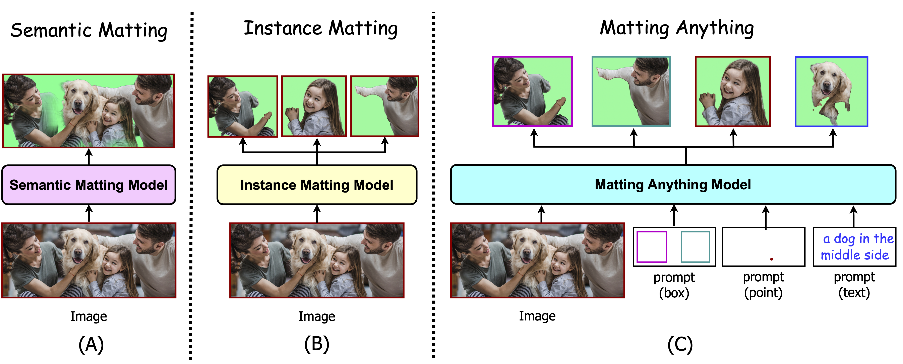

# Matting Anything
[](https://www.youtube.com/watch?v=XY2Q0HATGOk) []()
[](https://pytorch.org/)
[](https://opensource.org/licenses/MIT)

[Jiachen Li](https://chrisjuniorli.github.io/),
[Jitesh Jain](https://praeclarumjj3.github.io/),[Humphrey Shi](https://www.humphreyshi.com/home)

[[`Project page`](https://chrisjuniorli.github.io/project/Matting-Anything/)]
[[`ArXiv`](place_holder)]
[[`Pdf`](place_holder)]
[[`Video`](https://www.youtube.com/watch?v=XY2Q0HATGOk)]
[[`Demo`](place_holder)]



## Updates
- **`2023/06/07`**: [**Arxiv Preprint**]() and [**Huggingface Demo**]() are released.
- **`2023/06/06`**: [**Project Page**](https://chrisjuniorli.github.io/project/Matting-Anything) and [**Demo Video**](https://www.youtube.com/watch?v=XY2Q0HATGOk) are released.

## Contents
- [Matting-Anything](#matting-anything)
- [Installation](#installation)


## Matting Anything
### Abstract

In this paper, we propose the Matting Anything Model (MAM), an efficient and versatile framework for estimating the alpha matte of any instance in an image with flexible and interactive visual or linguistic user prompt guidance. MAM offers several significant advantages over previous specialized image matting networks: (i) MAM is capable of dealing with various types of image matting, including semantic, instance, and referring image matting with only a single model; (ii) MAM leverages the feature maps from the Segment Anything Model (SAM) and adopts a lightweight Mask-to-Matte (M2M) module to predict the alpha matte through iterative refinement, which has only 2.7 million trainable parameters. (iii) By incorporating SAM, MAM simplifies the user intervention required for the interactive use of image matting from the trimap to the box, point, or text prompt. We evaluate the performance of MAM on various image matting benchmarks, and the experimental results demonstrate that MAM achieves comparable performance to the state-of-the-art specialized image matting models under different metrics on each benchmark. Overall, MAM shows superior generalization ability and can effectively handle various image matting tasks with fewer parameters, making it a practical solution for unified image matting.

### Architecture

<div align="center">
  
</div><br/>
The MAM architecture consists of a pre-trained SAM and an M2M module. Given an
input image I, SAM generates the mask prediction for the target instance based on the box or point user prompt. The M2M module takes
the concatenated inputs, including the image, mask, and feature maps, and produces multi-scale predictions αos8, αos4, and αos1. The
iterative refinement process, detailed in Section 3, progressively improves the precision of the final meticulous alpha matte α, incorporating
information from the multi-scale outputs.

### Visualization

<div align="center">
  
</div>

<div align="center">
  
</div><br/>

We provide visualizations of the alpha matte
predictions from SAM and MAM. Notably, we emphasize
the differences in the red boxes. The visualizations demonstrate that MAM achieves improved predictions in the transition areas even without the trimap guidance. Additionally,
MAM effectively addresses some of the holes present in the mask predictions generated by SAM. These visual comparisons highlight the superior performance of MAM in refining and enhancing the quality of alpha matte predictions.

## Installation

Please refer to [Installation Instructions](INSTALL.md) for complete installation instructions of MAM.

## Getting Started

Please refer to [Getting Started](GETTING_STARTED.md) for dataset preparation, training and inference details of MAM.

## Citation

```bibtex
@article{li2023mam,
      title={{Matting Anything}},
      author={Jiachen Li and Jitesh Jain and Humphrey Shi},
      journal={arXiv}, 
      year={2023}
    }
```

## Acknowledgement

We thank the authors of [SAM](https://github.com/facebookresearch/segment-anything), [Grounded-SAM](https://github.com/IDEA-Research/Grounded-Segment-Anything), [MGMatting](https://github.com/yucornetto/MGMatting), and [InstMatt](https://github.com/nowsyn/InstMatt/tree/main) for releasing the codebases.


